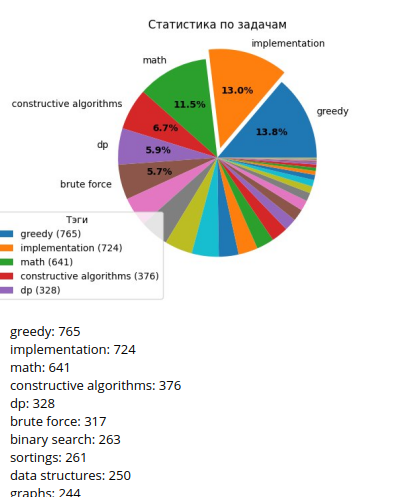

# cfdata

Это очередной мини-проект из серии; главная цель - попробовать сделать что-то самому.
В очередной раз я буду брать статистику - в этот раз с сайта [codeforces](http://codeforces.com/) - и как-то ей манипулировать. 

## Отличия от прошлых попыток
В этот раз используется [codeforces API](http://codeforces.com/apiHelp) для удобного доступа к данным.

Неизменным остаётся использование библиотеки matplotlib для построения графиков.

Новой вещью для меня стал вывод результатов через телеграм бота, используя библиотеку TelegramBotApi

## Входные данные 
Как и раньше, располагаем какой-то базой данных 

## Выходные данные 
 

За код-ревью и советы спасибо @dmitriypru
